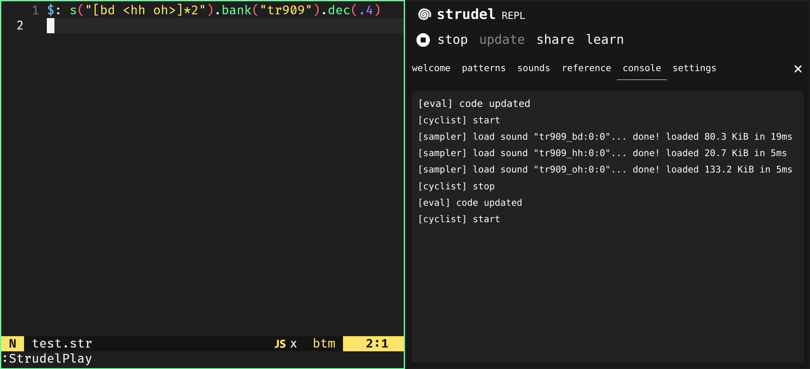

# strudel.nvim

A Neovim plugin that integrates with [Strudel](https://strudel.cc/), a live coding web editor for algorithmic music.

This plugin launches Strudel in a browser window and provides real-time two-way synchronization between a selected Neovim buffer and the Strudel editor as well as remote Strudel controls (play/stop, update).

<p align="center">
  
</p>

**🎉 Happy live coding & algorave! 🎵**

## Features

- **Real-time sync** - Two-way synchronization between Neovim buffer and Strudel editor.
- **Playback control** - Control Strudel's play/stop and update functions directly from Neovim.
- **Side by side workflow** - Maximized Strudel menu pannel (by default) for side by side Neovim-Strudel seamless workflow (effectively replacing the default Strudel editor by Neovim).
- **File based** - Save your files as `*.str` and open them right away in Strudel, anywhere on your file system (open and change files with your own file manager or fuzzy finder/picker).
- **Swap files** - Change the buffer that is synced to Strudel on the fly with a simple command.
- **File type support** - The plugin automatically sets the file type to `javascript` for `.str` files, providing proper syntax highlighting and language support.
- **Custom CSS injection** - Optionally inject your own CSS into the Strudel web editor by specifying a `custom_css_file` in the setup options. Allows you to fully customize the Strudel UI from your Neovim config.
- **Session persistence** - Remembers browser state across sessions.

Uses [Puppeteer](https://github.com/puppeteer/puppeteer) to control a real browser instance allowing you to write strudel code from Neovim (your favorite text editor) with all your regular config and plugins.

## Prerequisites

- [Neovim](https://neovim.io/) (0.9.0 or higher)
- [Node.js](https://nodejs.org) (16.0 or higher)
- [npm](https://www.npmjs.com/) for JavaScript package management
- [Chromium based browser](https://www.chromium.org/Home/) for web view launch

## Installation

First, make sure you have all the prerequisites installed on your system.

With [lazy.nvim](https://github.com/folke/lazy.nvim)

```lua
{
  "gruvw/strudel.nvim",
  build = "npm install",
  config = function()
    require("strudel").setup()
  end,
}
```

## Usage

### Basic Workflow

1. **Launch Strudel** - Open a `.str` file or any buffer in Neovim and run: `:StrudelLaunch`.
2. **Start Coding** - The Strudel editor will open in your browser with the content of the current buffer. By default the Strudel menu panel is maximized to allow for a seamless side by side workflow between Neovim and strudel (effectively hiding the default Strudel editor and replacing it by your Neovim window). Any changes you make in Neovim will be automatically synced to Strudel (and the other way arround as well).
3. **Control Playback** - Use `:StrudelPlayStop` to toggle playback, and `:StrudelUpdate` to trigger the update of your code (effectively remotely presses the _Play/Stop_ and _Update_ buttons on Strudel header).
4. **Exit Session**: When you're done, run: `:StrudelQuit` or close your browser/your Neovim window.

### Configuration

The plugin works out of the box with sensible defaults.  
The browser data is stored in `~/.cache/strudel-nvim/` (by default) for session persistence.

You can customize the plugin behavior by passing options to the setup function:

```lua
require("strudel").setup({
  -- Path to the directory where Strudel browser user data (cookies, sessions, etc.) is stored.
  browser_data_dir = "~/.cache/strudel-nvim/", -- (optional)
  -- Maximise the menu panel (default: true)
  maximise_menu_panel = true, -- (optional)
  -- Path to a custom CSS file to style the Strudel web editor (base64-encoded and injected at launch).
  -- This allows you to override or extend the default Strudel UI appearance.
  custom_css_file = "/path/to/your/custom.css", -- (optional)
  -- Set to `true` to automatically trigger the `StrudelUpdate` command after writing the buffer content.
  update_on_save = false,
})
```

Note - You have to call the `.setup()` function before using the plugin.

### Commands

| Command              | Lua Function                | Description                                                      |
|----------------------|----------------------------|------------------------------------------------------------------|
| `:StrudelStart`     | `strudel.start()` | Launch a Strudel browser session and start syncing a buffer.     |
| `:StrudelQuit`       | `strudel.quit()`   | Stop the Strudel session and disconnect from the browser.        |
| `:StrudelPlayStop`   | `strudel.play_stop()`      | Toggle playback (Play/Stop) in the Strudel editor.               |
| `:StrudelUpdate`     | `strudel.update()`         | Trigger the Update button in the Strudel editor.                 |
| `:StrudelSetBuffer`  | `strudel.set_buffer()`     | Change the buffer that is synced to Strudel (optionally by providing a buffer number, current buffer otherwise). |

**Note:** All Lua functions are available via `local strudel = require("strudel")` after setup.

### Keymaps

I would advise configuring the following Neovim Keymaps in your config:

```lua
local strudel = require("strudel")

vim.keymap.set("n", "<leader>ss", strudel.start, { desc = "Start Strudel" })
vim.keymap.set("n", "<leader>sq", strudel.quit, { desc = "Quit Strudel" })
vim.keymap.set("n", "<leader>sp", strudel.play_stop, { desc = "Strudel Play/Stop" })
vim.keymap.set("n", "<leader>su", strudel.update, { desc = "Strudel Update" })
vim.keymap.set("n", "<leader>sb", strudel.set_buffer, { desc = "Strudel set current buffer" })
vim.keymap.set("n", "<leader>sx", function()
  strudel.set_buffer()
  strudel.update()
end, { desc = "Strudel set current buffer and update" })
```

## How It Works

The plugin consists of two main components:

1. Lua Module (`lua/strudel/init.lua`) - Handles Neovim integration, buffer management, and remote communication with the JavaScript process.
2. JavaScript Process (`js/launch.js`) - Uses Puppeteer to control the browser, receives and sends commands, and interact with the Strudel web application.

### Communication Protocol

The Lua and JavaScript components communicate via stdin/stdout using a simple message protocol:

- `STRUDEL_CONTENT:<base64-content>` - Sync buffer content.
- `STRUDEL_STOP` - Stop the session.
- `STRUDEL_PLAY_STOP` - Trigger the _Play/Stop_.
- `STRUDEL_UPDATE` - Trigger the _Update_ button.
- `STRUDEL_READY` - Browser is ready (initialization).

### Synchronization

The plugin implements intelligent two-way synchronization:

- Neovim to Strudel - When the selected buffer's content changes, it trigger automatic updates to the Strudel editor.
- Strudel to Neovim (not necessarily useful) - Changes in the Strudel editor are detected and synced back to Neovim.

Note on Loop Prevention - Base64 content comparison prevents infinite update loops (and new lines issues).

## Troubleshooting

### Common Issues

- Browser doesn't open - Ensure Node.js and npm are properly installed.
- Permission errors - Ensure write permissions to the cache directory.
- Whole buffer content gets highlighted - Probably caused by the [highlight-undo.nvim](https://github.com/tzachar/highlight-undo.nvim) plugin. Use the following config:
```lua
require("highlight-undo").setup({
  -- ...
  ignore_cb = function(buf)
    local name = vim.api.nvim_buf_get_name(buf)
    return name:match("%.str$") ~= nil
  end,
})
```

## Acknowledgments

- [Strudel](https://strudel.cc/) - Web-based environment for live coding algorithmic patterns.
- [Puppeteer](https://pptr.dev/) - Browser automation library and JavaScript API for Chrome and Firefox.
- [Neovim](https://neovim.io/) - Vim-fork focused on extensibility and usability.
